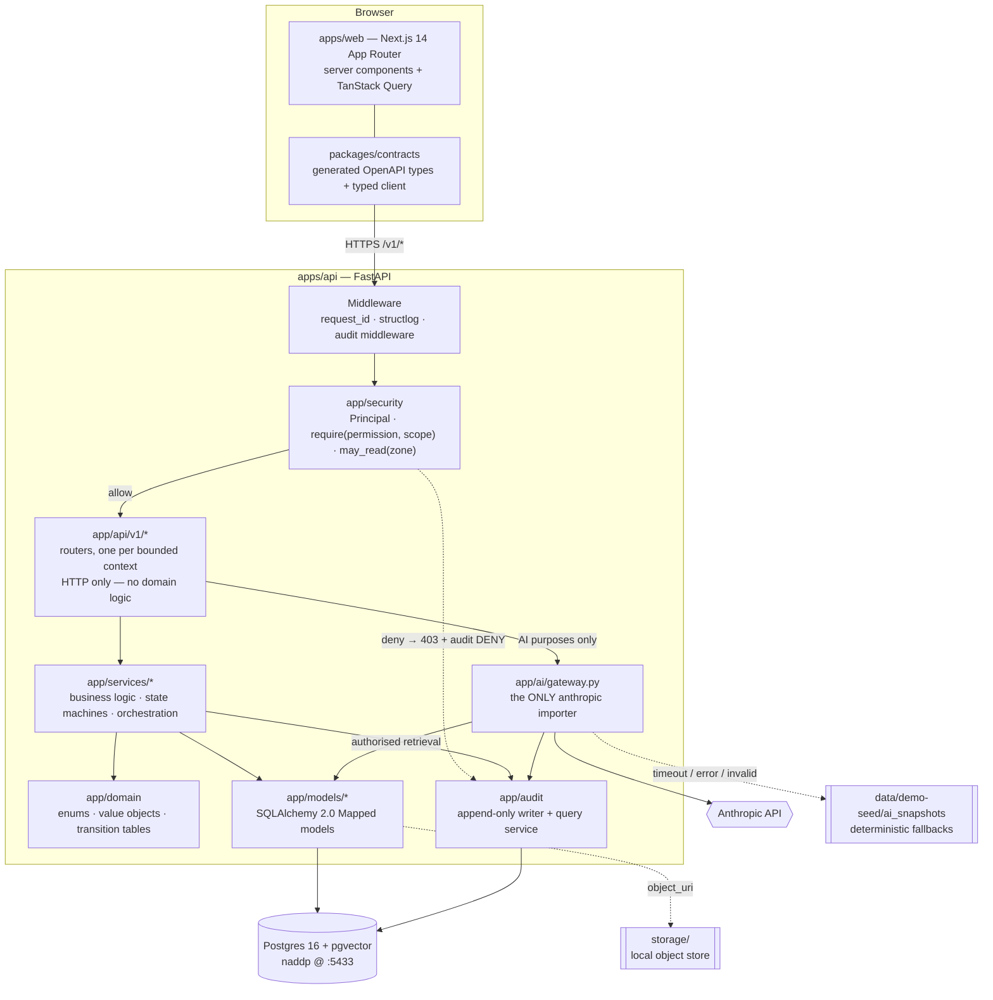
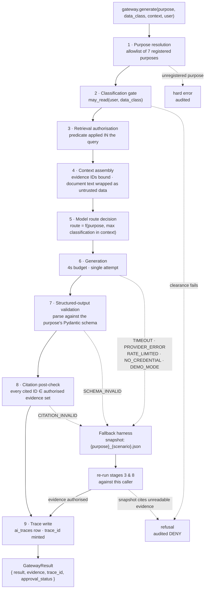

# NADDP — Architecture Overview

> This describes **this repository**: what is here, how a request moves through it, and where the
> governance seams sit. It is a working note for contributors, not a proposal. Decisions are recorded
> in [`adr/`](adr/README.md); this document explains how they fit together.

Scope: the Week 1 foundation of the Ambassador demo — the same domain model and API shape as
production, with production-only complexity deferred (`BUILD_BIBLE.md` §0).

---

## 1. Shape of the system

Three deployable things and one shared package:

| Component | Path | Stack | Runs on |
|---|---|---|---|
| Staff + citizen web app | `apps/web` | Next.js 14 App Router, TypeScript strict, Tailwind, shadcn/ui, TanStack Query | Vercel (port 3000 locally) |
| API | `apps/api` | FastAPI, Pydantic v2, SQLAlchemy 2.0 (sync) + psycopg 3, Alembic | Railway (port 8000 locally) |
| Database | — | Postgres 16 + pgvector | Railway (Docker locally, host port 5433) |
| Typed API client | `packages/contracts` | Generated from the API's OpenAPI schema | consumed by `apps/web` |

Supporting directories: `data/taxonomy` (controlled vocabularies), `data/demo-seed` (synthetic dataset
and citation registry), `storage/` (local object store), `evals/` (grounding and security eval stubs),
`infra/` (deployment configuration), `docs/` (this).

The web app never talks to the database. The API is the only thing holding a connection string, an API
key, or a permission matrix. `NEXT_PUBLIC_API_URL` is the only backend coordinate the browser knows.

---

## 2. Bounded contexts

Eight contexts (`BUILD_BIBLE.md` §8). They are the primary decomposition: `app/models/`,
`app/schemas/`, `app/services/` and `app/api/v1/` are each split by these names, and the names are
used verbatim everywhere — in module paths, in `object_type` audit values, and in `object_uri` paths.

| Context | Owns | Core tables |
|---|---|---|
| **intelligence** | External signals, their sources and evidence, and the daily brief assembled from them. Every signal cites a real public URL. | `sources`, `documents`, `signals`, `briefs`, `brief_items` |
| **opportunities** | Bilateral opportunities detected from signals, their scoring, and the pipeline state machine. | `opportunities` |
| **stakeholders** | People and organisations on both sides of the relationship, and the interaction history that constitutes relationship health. | `stakeholders`, `organisations`, `interactions` |
| **meetings** | Meetings, AI-assisted pre-reads, follow-up drafts and the actions arising. The follow-up approval gate lives here. | `meetings`, `actions` |
| **consular** | Citizen service cases, their immutable event timeline, and the evidence attached to them. Highest-sensitivity context. | `cases`, `case_events`, `case_evidence` |
| **diaspora** | Consent-governed profiles of diaspora expertise, and expertise-based search. | `diaspora_profiles`, `expertise_tags` |
| **knowledge** | Approved reference material and grounded question answering; refuses when no approved source supports an answer. | `knowledge_articles` |
| **governance** | Identity, roles, permissions, the audit log, and AI traces. The context every other context depends on. | `users`, `roles`, `permissions`, `user_roles`, `audit_events`, `ai_traces` |

Dependency direction: the seven substantive contexts depend on **governance**; governance depends on
none of them. Contexts do not import each other's services — cross-context work goes through the
router layer, which composes. The one intentional exception is the AI Gateway, which reads through
the retrieval layer of whichever context supplies its evidence (ADR-0001).

The hero thread (`BUILD_BIBLE.md` §2) deliberately crosses all eight: a lithium signal
(intelligence) becomes an opportunity, attaches to a stakeholder, is prepared for in a meeting,
touches a student's passport case (consular), surfaces two diaspora experts, and is answered from
knowledge — all of it audited (governance).

---

## 3. Layering and the request path

Read the path in words:

1. **Browser → API.** The web app calls `/v1/...` through the generated client in
   `packages/contracts`. Types are generated from the API's own OpenAPI schema (`make gen-client`), so
   a contract change that breaks the client breaks the TypeScript build rather than production.
2. **Middleware.** Assigns a `request_id`, binds it into structlog, and resolves the signed
   `naddp_demo_session` cookie to a `Principal` (`user_id`, `role`, `clearance`, `compartments`,
   `permissions`). The audit middleware records authentication, privileged reads, exports and denials.
3. **Security.** `require(permission, scope)` is a FastAPI dependency on every route,
   deny-by-default (ADR-0003). Classification is the second axis (ADR-0006). Both must pass.
4. **Router (`app/api/v1/<context>.py`).** HTTP concerns only: parse, validate, delegate, serialise.
   A router that contains an `if` about domain state is a bug (`CLAUDE.md` §5).
5. **Service (`app/services/<context>/`).** All business logic: state-machine transitions, scoring,
   composition across contexts. Receives a `Session`; opens no transactions of its own. Writes the
   audit row **in the same transaction** as the state change (ADR-0004).
6. **Model (`app/models/<context>.py`).** SQLAlchemy 2.0 typed models. Authorisation predicates are
   applied **in the query**, never to the result set (`CLAUDE.md` §5) — so a row the caller may not
   read is never loaded and cannot leak through a count or a pagination total.
7. **Postgres.** Sync engine, psycopg 3 (ADR-0005). Handlers are plain `def`, so blocking I/O runs in
   FastAPI's threadpool and never on the event loop.
8. **Object storage.** Document bytes live under `storage/` and are referenced by
   `documents.object_uri`; the row, not the file, carries the classification.

---

## 4. The two governance seams

Everything that makes this demo credible sits on two seams. Both are crossed on **every** request.

### Seam A — authorisation, between middleware and router

`app/security/` resolves the `Principal` and evaluates two independent questions:

- **Permission:** may this role perform this verb on this object type? (`require(...)`, deny-by-default)
- **Classification:** may this principal read content in this zone? (`may_read(...)`, rank + compartment)

Neither implies the other. `read:consular_case` does not grant sight of a `CONSULAR_SENSITIVE`
attachment; clearance to read `CONFIDENTIAL` material does not grant the consular compartment.
`bulk_export` is its own permission on its own axis, never implied by any read.

The seam is crossed *before* the query runs, and the outcome — `ALLOW` or `DENY` — is what the audit
row's `policy_result` records. Denials are logged as loudly as successes; that is what makes the
control demonstrable rather than merely asserted.

Only **one** thing on this seam is faked: how the `Principal` was established. `POST /v1/session/assume-role`
sets a signed demo cookie instead of completing an OIDC flow. Replacing it is a change to one function.

### Seam B — audit, between service and database

`app/audit/writer.py` is the only writer of `audit_events`, and the table accepts only `INSERT`
(revoked `UPDATE`/`DELETE`/`TRUNCATE`, plus a `BEFORE UPDATE OR DELETE` trigger, plus a SQLAlchemy
`before_flush` guard — ADR-0004). Middleware writes the automatic events; services write the
transitions, in-transaction. If the audit write fails, the state change rolls back.

`audit_events` is where "who decided this, on what basis, when" is answered.
`ai_traces` is where "what did the model see and produce" is answered. They join on `request_id`, and
the UI trace drawer renders both together.

---

## 5. Where the AI Gateway sits

The Gateway is not a layer — it is a **door in the wall**, at the same depth as a service, reachable
only from the router layer.

- **Callers:** routers, for the seven registered purposes. Services never call it; that would let
  domain logic smuggle its own context in.
- **Callees:** the retrieval layer, under the *caller's* identity, and the model provider.
- **Exclusivity:** `apps/api/app/ai/gateway.py` is the only file allowed to import `anthropic`,
  enforced by an AST-based test and a Ruff `banned-api` rule (ADR-0001).
- **Envelope:** every AI response is `{ result, evidence, trace_id, approval_status }`. Never raw prose.
- **Never dead-ends:** a 4-second budget, then a deterministic snapshot keyed by `purpose + scenario`,
  with `fallback=true` on the trace (ADR-0002).

The Gateway never receives a context blob from its caller. It takes a purpose, a declared data class,
a small context descriptor (which object, which scenario), and the principal — and retrieves its own
evidence under that principal's authority. That single property is what makes
"authorisation precedes retrieval" true.

### The nine-stage pipeline

Three properties of this diagram carry the demo:

- **Stages 2 and 3 run before stage 6.** Nothing the caller may not read ever enters a prompt.
- **The fallback path rejoins at stage 9, not at the output.** A cached answer is still traced, still
  re-authorised against this caller, and still carries its `approval_status`. It is a cached answer,
  never an authorisation exemption.
- **`approval_status` is set here, not by the caller.** `meeting_followup` and `consular_triage`
  return a pending-approval status, so a consequential action is blocked by construction rather than
  by a UI convention (`BUILD_BIBLE.md` §6 — winning moment #2).

---

## 6. Cross-cutting conventions

| Concern | Convention |
|---|---|
| API prefix | `/v1` — e.g. `POST /v1/session/assume-role`, `GET /v1/command/today`. Not `/api/v1`. |
| Identifiers | ULID rendered into a `uuid` column, everywhere. `cases.public_ref` is an independent random token (ADR-0007). |
| Classification | Four zones, `max`-propagating into every derived artefact including AI output and evidence lists (ADR-0006). |
| Correlation | One `request_id` per request, on every log line, every `audit_events` row, and every `ai_traces` row. |
| Concurrency | Sync SQLAlchemy; DB-touching handlers are plain `def` (ADR-0005). |
| Vectors | pgvector, `vector(1536)` on `documents` and `knowledge_articles`. Vector search applies the classification predicate before ranking. |
| Object storage | `file://storage/<context>/<ulid>/<filename>` — see `storage/README.md`. |
| Contracts | `packages/contracts` is **generated**, never hand-edited. `make gen-client` regenerates it. |
| Secrets | Server-side only. Nothing sensitive may appear in the client bundle (`BUILD_BIBLE.md` §11). |
| Demo labelling | A persistent DEMO / SYNTHETIC badge on every screen, staff and citizen. |

---

## 7. What is deliberately not here (Week 1)

Stated so nobody mistakes an absence for an oversight:

- **No identity provider.** Role picker only; the RBAC behind it is real (ADR-0003).
- **No live model calls yet.** The Gateway seam and the fallback harness are built; purposes go live in
  Weeks 2 and 3.
- **No workflow engine.** The three state machines in [`../workflows.md`](../workflows.md) are
  implemented in-code with server-side validation; the Temporal interface is stubbed and deferred
  (`BUILD_BIBLE.md` §3).
- **No per-object classification grants.** Ranks and compartments only; grants are Week 3+.
- **No audit partitioning or archival.** Correct for demo volume, a known debt for the pilot.
- **No ingestion pipeline.** Signals arrive via the seed; scheduled ingestion is a pilot-backlog item.

---

## 8. Where to look next

| Question | File |
|---|---|
| Why is it built this way? | [`adr/README.md`](adr/README.md) |
| What are the exact state transitions and their audit actions? | [`../workflows.md`](../workflows.md) |
| What is still ambiguous? | [`../OPEN_QUESTIONS.md`](../OPEN_QUESTIONS.md) |
| How is it deployed? | [`../../infra/README.md`](../../infra/README.md) |
| How is AI quality and safety measured? | [`../../evals/README.md`](../../evals/README.md) |
| What vocabularies does the seed use? | [`../../data/taxonomy/README.md`](../../data/taxonomy/README.md) |
