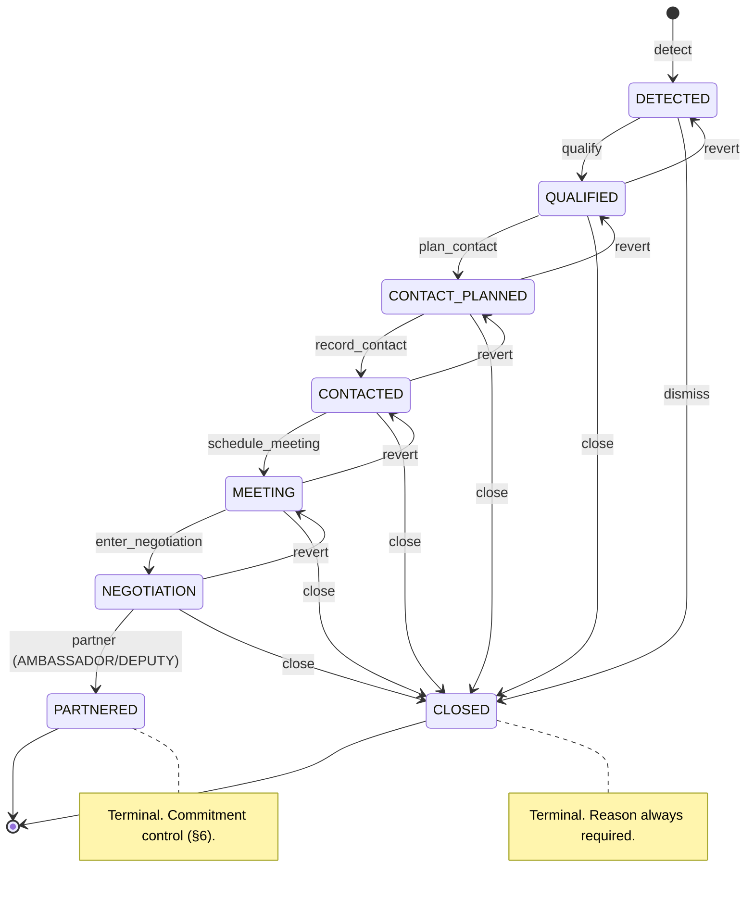
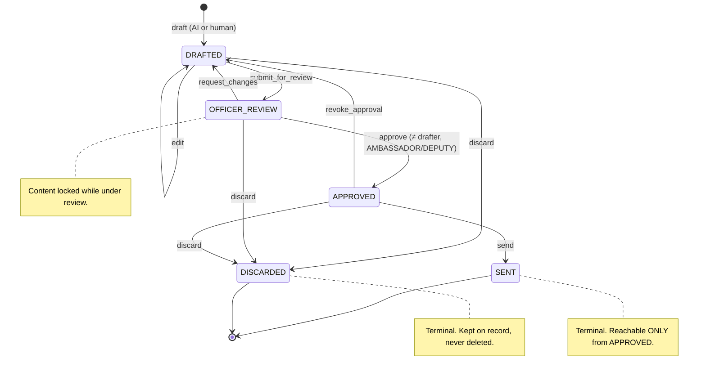
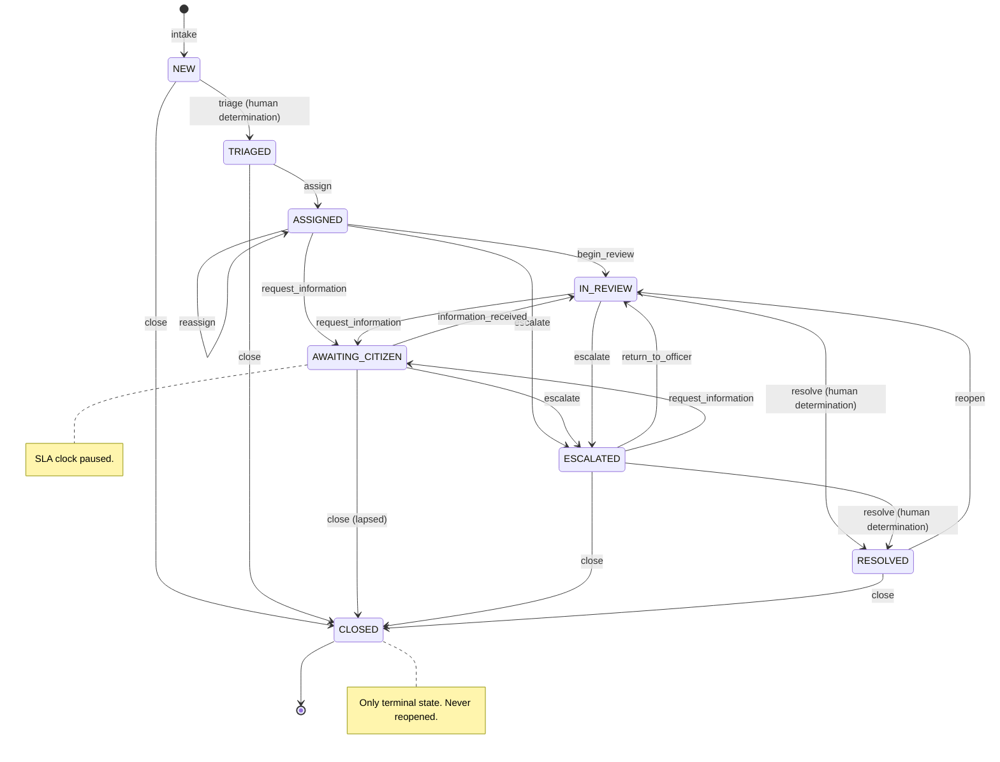

# Workflows — State Machine Contract

> This is the **binding specification** for the three workflow state machines in `BUILD_BIBLE.md` §9.
> A later track implements it in `apps/api/app/domain/` (transition tables) and
> `apps/api/app/services/` (execution). Route handlers contain no transition logic.
>
> Every table below is normative. If the implementation disagrees with this document, the
> implementation is wrong — or this document is superseded by an explicit edit, not by drift.

---

## 0. Rules that apply to all three machines

1. **Deny-by-default and table-driven.** A transition is legal only if `(from_state, event)` appears in
   that machine's table. Anything else raises `IllegalTransition` and returns HTTP 409. There is no
   "set the state to X" endpoint — only events.
2. **Server-validated.** The client sends an event, never a target state. The server computes the
   target from the table. A client that proposes a state is ignored.
3. **Permission is checked before the transition is attempted.** The `Required permission` column is a
   `require(...)` dependency (ADR-0003). A denial writes an audit row with `policy_result = DENY` and
   does **not** change state.
4. **Every transition writes exactly one `audit_events` row**, in the same transaction as the state
   change (ADR-0004). If the audit write fails, the transition rolls back. The `Audit action` column
   gives the exact `action` value — these strings are a closed vocabulary in
   `app/audit/actions.py` and must match character for character.
5. **Audit `detail` shape for a transition** is fixed:
   ```json
   { "from_state": "...", "to_state": "...", "event": "...", "reason": "...|null", "trace_id": "...|null" }
   ```
   `trace_id` is present when an AI artefact informed the transition; `reason` is present when the
   table marks it required.
6. **Terminal states accept no events.** Every attempt raises `IllegalTransition`. Terminal states are
   marked ⏹ and listed explicitly per machine. Recovery from a terminal state means creating a **new**
   object that references the old one — never resurrecting it.
7. **No transition is autonomous.** Every event has an authenticated human actor
   (`BUILD_BIBLE.md` §6). The AI Gateway may produce a *proposal* carrying
   `approval_status = PENDING_APPROVAL`; a proposal is data, not an event. The state machine only
   advances when a human with the listed permission fires the event.
8. **Idempotency.** Firing an event that is already reflected in the current state (for example
   `approve` on an already-`APPROVED` follow-up) is a no-op returning 200 with the current state, and
   writes **no** second audit row. It is not an error, and it is not a duplicate transition.
9. **Optimistic concurrency.** Every transition request carries the object's current `version`; a
   mismatch returns 409 without changing state. Two officers cannot race a case into two states.
10. **Reason text is never free-form into the audit log unbounded.** Where `reason` is required it is
    capped at 500 characters, stored in the object's own reason column, and referenced (not copied in
    full) in the audit `detail`.

Legend: ⏹ terminal · ⚠ non-autonomous control per `BUILD_BIBLE.md` §6 · ✎ requires `reason`

---

## 1. Opportunity

**Object:** `opportunities` · **Context:** `opportunities` · **`object_type`:** `opportunities.opportunity`

`BUILD_BIBLE.md` §9: `DETECTED → QUALIFIED → CONTACT_PLANNED → CONTACTED → MEETING → NEGOTIATION → PARTNERED/CLOSED`

### States

| State | Meaning | Terminal |
|---|---|---|
| `DETECTED` | Created from an intelligence signal. Not yet judged worth pursuing. Initial state; the only state an opportunity may be created in. | |
| `QUALIFIED` | A human has judged it real and in scope. Scoring is explainable and editable from here on. | |
| `CONTACT_PLANNED` | An approach has been decided: who contacts whom, and with what ask. | |
| `CONTACTED` | The approach has been made and recorded as an interaction. | |
| `MEETING` | A meeting is scheduled or has occurred; the opportunity is live with a counterpart. | |
| `NEGOTIATION` | Substantive terms are under discussion. Content here is typically `CONFIDENTIAL` (ADR-0006). | |
| `PARTNERED` | A partnership has been concluded. Success terminal. | ⏹ |
| `CLOSED` | Not proceeding — dismissed, lapsed, lost, or superseded. Single non-success terminal; always carries a reason. | ⏹ |

### Transitions

| # | From | Event | To | Required permission | Audit action | Notes |
|---|---|---|---|---|---|---|
| 1 | *(none)* | `detect` | `DETECTED` | `create:opportunity` | `opportunity.detected` | Creation. `detail.source_signal_id` required. |
| 2 | `DETECTED` | `qualify` | `QUALIFIED` | `qualify:opportunity` | `opportunity.qualified` | Requires a non-null score and at least one evidence reference. |
| 3 | `DETECTED` | `dismiss` | `CLOSED` ⏹ | `close:opportunity` | `opportunity.closed` | ✎ `close_reason` required. |
| 4 | `QUALIFIED` | `plan_contact` | `CONTACT_PLANNED` | `advance:opportunity` | `opportunity.contact_planned` | Requires a linked `stakeholders.stakeholder`. |
| 5 | `QUALIFIED` | `close` | `CLOSED` ⏹ | `close:opportunity` | `opportunity.closed` | ✎ |
| 6 | `CONTACT_PLANNED` | `record_contact` | `CONTACTED` | `advance:opportunity` | `opportunity.contacted` | Requires a linked `stakeholders.interaction`. |
| 7 | `CONTACT_PLANNED` | `close` | `CLOSED` ⏹ | `close:opportunity` | `opportunity.closed` | ✎ |
| 8 | `CONTACTED` | `schedule_meeting` | `MEETING` | `advance:opportunity` | `opportunity.meeting_scheduled` | Requires a linked `meetings.meeting`. |
| 9 | `CONTACTED` | `close` | `CLOSED` ⏹ | `close:opportunity` | `opportunity.closed` | ✎ |
| 10 | `MEETING` | `enter_negotiation` | `NEGOTIATION` | `advance:opportunity` | `opportunity.negotiation_opened` | Classification is raised to at least `CONFIDENTIAL` on entry. |
| 11 | `MEETING` | `close` | `CLOSED` ⏹ | `close:opportunity` | `opportunity.closed` | ✎ |
| 12 | `NEGOTIATION` | `partner` | `PARTNERED` ⏹ | `commit:opportunity` ⚠ | `opportunity.partnered` | **§6 control — a commitment.** `AMBASSADOR` or `DEPUTY` only. Never AI-initiated. |
| 13 | `NEGOTIATION` | `close` | `CLOSED` ⏹ | `close:opportunity` | `opportunity.closed` | ✎ |
| 14 | `QUALIFIED`, `CONTACT_PLANNED`, `CONTACTED`, `MEETING`, `NEGOTIATION` | `revert` | *immediately preceding state* | `revert:opportunity` | `opportunity.reverted` | ✎ Corrects a mis-advance. One step only, never across a terminal. `DEPUTY` / `AMBASSADOR` only, reason required, and the reason reaches the audit row's payload. Q-04 **RESOLVED — approved**. |

Terminal states: `PARTNERED`, `CLOSED`. Neither is reopenable. A revived opportunity is a new
`DETECTED` row carrying `superseded_opportunity_id`.

### Permission grants

| Permission | AMBASSADOR | DEPUTY | TRADE_OFFICER | CONSULAR_OFFICER | DIASPORA_OFFICER | ADMIN |
|---|:-:|:-:|:-:|:-:|:-:|:-:|
| `create:opportunity` | ✔ | ✔ | ✔ | — | — | — |
| `qualify:opportunity` | ✔ | ✔ | ✔ | — | — | — |
| `advance:opportunity` | ✔ | ✔ | ✔ | — | — | — |
| `close:opportunity` | ✔ | ✔ | ✔ | — | — | — |
| `commit:opportunity` ⚠ | ✔ | ✔ | — | — | — | — |
| `revert:opportunity` | ✔ | ✔ | — | — | — | — |

### Diagram



---

## 2. Meeting follow-up

**Object:** `meeting_followups` (a follow-up artefact attached to a `meetings.meeting`; one meeting may
accumulate several, at most one of them live) · **Context:** `meetings` · **`object_type`:** `meetings.followup`

`BUILD_BIBLE.md` §9: `DRAFTED → OFFICER_REVIEW → APPROVED → SENT`

This is **winning moment #2** — "AI drafts, humans decide". The block on `send` must be visible in the
UI, and the reason for the block must be legible: *this action requires approval by a second person
holding `approve:meeting_followup`.*

### States

| State | Meaning | Terminal |
|---|---|---|
| `DRAFTED` | A draft exists. Produced by the Gateway purpose `meeting_followup` with `approval_status = PENDING_APPROVAL`, or written by hand. Freely editable. Initial state. | |
| `OFFICER_REVIEW` | Submitted for approval. **Locked for editing** — the artefact an approver sees is the artefact that gets sent. Any edit requires returning to `DRAFTED`. | |
| `APPROVED` | A human other than the drafter has approved it. Sending is now permitted. Still not sent. | |
| `SENT` | Dispatched to the external recipient. Success terminal; content immutable thereafter. | ⏹ |
| `DISCARDED` | Abandoned without sending, with who, when and a recorded reason. Non-success terminal. **Confirmed** by the architect's Q-05 ruling (`docs/OPEN_QUESTIONS.md`, RESOLVED 2026-09-15): a drafted diplomatic communication is never deleted — discarding it is itself an audited act, and the row is kept. | ⏹ |

### Transitions

| # | From | Event | To | Required permission | Audit action | Notes |
|---|---|---|---|---|---|---|
| 1 | *(none)* | `draft` | `DRAFTED` | `draft:meeting_followup` | `meeting_followup.drafted` | `detail.trace_id` required when AI-generated. Records `drafted_by`. A meeting holds one live follow-up (`DRAFTED`, `OFFICER_REVIEW`, `APPROVED`) at a time; a second draft is refused (409 `live_followup_exists`, audited against the meeting). A re-draft after `SENT` or `DISCARDED` is a new row carrying `supersedes_followup_id`. |
| 2 | `DRAFTED` | `edit` | `DRAFTED` | `draft:meeting_followup` | `meeting_followup.edited` | Self-transition. Audited because the content of an outbound communication changed. **Only the drafter** may edit: anyone else is refused as 403 `separation_of_duties` (see *Authorisation beyond the matrix*), so the approver can never be the author of the words they approve. |
| 3 | `DRAFTED` | `submit_for_review` | `OFFICER_REVIEW` | `submit:meeting_followup` | `meeting_followup.submitted` | Recipient list and subject must be non-empty. Content locks. |
| 4 | `DRAFTED` | `discard` | `DISCARDED` ⏹ | `discard:meeting_followup` | `meeting_followup.discarded` | ✎ |
| 5 | `OFFICER_REVIEW` | `approve` | `APPROVED` | `approve:meeting_followup` ⚠ | `meeting_followup.approved` | **§6 control — external outreach.** Approver **must not** be the drafter (separation of duties, enforced server-side as 403 `separation_of_duties` and by `ck_meeting_followups_approver_is_not_drafter`). `AMBASSADOR` / `DEPUTY` only. |
| 6 | `OFFICER_REVIEW` | `request_changes` | `DRAFTED` | `approve:meeting_followup` | `meeting_followup.changes_requested` | ✎ Rejection path. Content unlocks. |
| 7 | `OFFICER_REVIEW` | `discard` | `DISCARDED` ⏹ | `discard:meeting_followup` | `meeting_followup.discarded` | ✎ |
| 8 | `APPROVED` | `send` | `SENT` ⏹ | `send:meeting_followup` ⚠ | `meeting_followup.sent` | **§6 control — diplomatic communication.** Legal **only** from `APPROVED`. `detail.recipient_count` required; the row also names the approver (`approved_by_user_id`, `approved_by_name`) and records `dispatch_simulated: true`. From `DRAFTED` or `OFFICER_REVIEW` a `send` is refused as 403 `approval_required`, not 409 — see *Authorisation beyond the matrix* below. |
| 9 | `APPROVED` | `revoke_approval` | `DRAFTED` | `approve:meeting_followup` | `meeting_followup.approval_revoked` | ✎ Withdraws approval before dispatch. Content unlocks. |
| 10 | `APPROVED` | `discard` | `DISCARDED` ⏹ | `discard:meeting_followup` | `meeting_followup.discarded` | ✎ |

Terminal states: `SENT`, `DISCARDED`. A follow-up to a sent follow-up is a new artefact.

**The load-bearing invariant:** `SENT` is reachable from `APPROVED` and from nowhere else. There is no
event, no permission, no administrative path, and no AI purpose that produces `SENT` from any other
state. A test asserts this directly over the transition table.

### Authorisation beyond the matrix

*Added in W3.2 (2026-09-15). This subsection explicitly supersedes rule 0.1 for the `send` event, and
refines it for `approve`.*

Rule 0.1 answers every `(state, event)` pair missing from a table with 409. For `send` on a follow-up
nobody has approved, that is the wrong answer: the sender holds `send:meeting_followup` — the grant is
wide on purpose — and what is missing is an **approval**, which is an authorisation outcome, not an
illegal pair. So the shared executor (`app/services/state_machine.py`) lets a machine attach an
**event authorization** to an event, and this machine attaches two.

An event authorization runs **after** the terminal-state check and **before** the table lookup, in this
order: (i) the actor must hold the event's permission, else 403 `permission_denied`; (ii) the actor must
be cleared for the follow-up's zone, else 403 `classification_denied`; (iii) the authorization itself
must pass. Every refusal writes a `policy_result = DENY` row under the **event's own** audit action.

| Event | Passes when | Refusal |
|---|---|---|
| `send` | The follow-up is `APPROVED` and names an approver who is not its drafter. | 403 `approval_required` from `DRAFTED` or `OFFICER_REVIEW`, carrying the officers who could approve it. DENY row `meeting_followup.sent`. State unchanged. |
| `approve` | The actor is not the follow-up's drafter. | 403 `separation_of_duties`. DENY row `meeting_followup.approved`. |

Terminal states still answer first: `send` on a `SENT` follow-up is 409 `terminal_state`, never
`approval_required`. An idempotent re-fire (`submit_for_review` on `OFFICER_REVIEW`, `approve` on
`APPROVED`) is still a 200 no-op, but only for an actor holding the event's permission and cleared for
the follow-up; anyone else is refused (403, audited) rather than told the current state.

**The dispatch intent (200 or 202).** "Send" in the product is a request to dispatch, not a raw event.
`POST /v1/meetings/{meeting_id}/followups/{followup_id}/dispatch`:

- `APPROVED`: fires `send`. **200**, `SENT`.
- `DRAFTED`: the executor refuses `send` (DENY row committed). Because a send can only ever follow an
  approval, the service then fires `submit_for_review` as the same officer (ALLOW row) and answers
  **202 Accepted**: the follow-up is `OFFICER_REVIEW`, and the response names who can approve it.
- `OFFICER_REVIEW`: the refusal is recorded. **202**, state unchanged.

The raw transition endpoint still exists, and `{"event": "send"}` there on a follow-up that is not
approved is a plain **403 `approval_required`** with no auto-submit. That is the API refusing a direct
send.

**Approve-and-dispatch.** `POST /v1/meetings/{meeting_id}/followups/{followup_id}/approve` fires `approve`
(`OFFICER_REVIEW` to `APPROVED`, committed) and then `send` (`APPROVED` to `SENT`, committed), both as the
approver: two audit rows, and the `meeting_followup.sent` payload carries `approved_by_user_id` and
`approved_by_name`. If that `send` were refused, the follow-up rests legitimately at `APPROVED`.

**Dispatch is simulated.** Nothing is transmitted. Recipients are role or organisation labels, never
addresses (a CHECK forbids `@`); the `meeting_followup.sent` payload records `dispatch_simulated: true`,
and the API reports `dispatch_is_simulated: true`.

**What the database guarantees on its own** (`meeting_followups`, W3.2 migration), whatever issued the
statement:

- `ck_meeting_followups_sent_requires_approval` — `sent_at` requires `approved_by_user_id` and
  `approved_at`.
- `ck_meeting_followups_sent_status_iff_timestamp` — `SENT` if and only if `sent_at` is set.
- `ck_meeting_followups_approved_states_name_approver` — `APPROVED` and `SENT` rows name their approver.
- `ck_meeting_followups_approved_states_were_submitted` — `APPROVED` and `SENT` rows record a submission.
- `ck_meeting_followups_unapproved_states_carry_no_approval` — `DRAFTED` and `OFFICER_REVIEW` rows carry no
  approver and no approval time, so an approval cannot survive a return to `DRAFTED`.
- `ck_meeting_followups_approval_follows_submission` and `ck_meeting_followups_dispatch_follows_approval` —
  where both moments are recorded, `submitted_at <= approved_at <= sent_at`.
- `ck_meeting_followups_approver_is_not_drafter` — separation of duties.
- `ck_meeting_followups_discarded_requires_reason` and `ck_meeting_followups_discard_fields_only_when_discarded`
  — a discard names who, when and a reason with at least one non-whitespace character
  (`discard_reason ~ '[^[:space:]]'`), and only a discarded row carries them.
- `ck_meeting_followups_recipients_are_labels` — one to eight labels, no `@`.
- `uq_meeting_followups_one_live_per_meeting` — a partial unique index: at most one follow-up per
  meeting in `DRAFTED`, `OFFICER_REVIEW` or `APPROVED`.
- Triggers: `trg_meeting_followups_no_delete` and `trg_meeting_followups_no_truncate` — rows are never
  deleted. `trg_meeting_followups_guard_update`, on every `UPDATE`, in order: (1) a `SENT` or `DISCARDED`
  row is immutable; (2) `meeting_id`, `drafted_by_user_id`, `drafted_at`, `trace_id` and
  `supersedes_followup_id` never change; (3) a status change must be one of the table's pairs —
  `DRAFTED` → `OFFICER_REVIEW`/`DISCARDED`, `OFFICER_REVIEW` → `APPROVED`/`DRAFTED`/`DISCARDED`,
  `APPROVED` → `SENT`/`DRAFTED`/`DISCARDED` — so no single statement skips review or approval;
  (4) `subject`, `recipients` and `body` change only on a `DRAFTED` → `DRAFTED` update, never in the
  statement that leaves `DRAFTED`; (5) `approved_by_user_id` and `approved_at` are set together only on
  `OFFICER_REVIEW` → `APPROVED` and cleared together only on a return to `DRAFTED` — an approval, once
  given, is never rewritten, including in the `APPROVED` → `SENT` statement.

**What that adds up to, and where it stops.** By `UPDATE`, a follow-up can reach `SENT` only from
`APPROVED`, with its approval unchanged since it was given and its content frozen since submission. Every
`SENT` row names an approver other than the drafter, an approval time and a submission. The database
**cannot** tell whether the named approver actually held `approve:meeting_followup`: the service (the
matrix and the event authorizations above) and the append-only `audit_events` chain are what prove a
human with that permission approved it. And a raw `INSERT` of a row that is already `SENT` — the path the
seed and the migration's data copy use to record history — satisfies every constraint without being an
approval act; the triggers guard `UPDATE`, not `INSERT`.

### Permission grants

| Permission | AMBASSADOR | DEPUTY | TRADE_OFFICER | CONSULAR_OFFICER | DIASPORA_OFFICER | ADMIN |
|---|:-:|:-:|:-:|:-:|:-:|:-:|
| `draft:meeting_followup` | ✔ | ✔ | ✔ | ✔ | ✔ | — |
| `submit:meeting_followup` | ✔ | ✔ | ✔ | ✔ | ✔ | — |
| `approve:meeting_followup` ⚠ | ✔ | ✔ | — | — | — | — |
| `send:meeting_followup` ⚠ | ✔ | ✔ | ✔ | ✔ | ✔ | — |
| `discard:meeting_followup` | ✔ | ✔ | ✔ | ✔ | ✔ | — |

`send` is deliberately widely held: the officer who drafted it may dispatch it, but only after someone
senior has approved it. Holding `send` without an `APPROVED` artefact achieves nothing. This is a
sharper demonstration than restricting `send` would be — the block is structural, not merely a
permission the demo persona happens to lack.

### Diagram



---

## 3. Consular case

**Object:** `cases` · **Context:** `consular` · **`object_type`:** `consular.case`

`BUILD_BIBLE.md` §9: `NEW → TRIAGED → ASSIGNED → AWAITING_CITIZEN/IN_REVIEW → ESCALATED → RESOLVED → CLOSED`

Highest-sensitivity machine in the system. Default classification `CONSULAR_SENSITIVE` (ADR-0006), and
**no consular determination may be autonomous** (`BUILD_BIBLE.md` §6). The Gateway purpose
`consular_triage` produces a *proposed* triage — a case type, a priority and a rationale, with
`approval_status = PENDING_APPROVAL`. It never fires an event.

Every transition additionally appends an immutable `case_events` row (the citizen-visible-in-summary
case timeline) as well as the `audit_events` row (the governance log). Both are written in the same
transaction; `case_events` carries no content the citizen may not see.

### States

| State | Meaning | SLA clock | Terminal |
|---|---|---|---|
| `NEW` | Received, not yet assessed. Initial state. | running | |
| `TRIAGED` | A human has confirmed the case type, priority and classification. | running | |
| `ASSIGNED` | Allocated to a named consular officer. | running | |
| `AWAITING_CITIZEN` | Blocked pending information or documents from the citizen. | **paused** | |
| `IN_REVIEW` | Actively being worked, or under determination by the assigned officer. | running | |
| `ESCALATED` | Raised for a decision above the assigned officer — complexity, sensitivity, SLA breach risk, or a welfare/detention matter. | running | |
| `RESOLVED` | A determination has been made and communicated. Not yet closed; reopenable. | stopped | |
| `CLOSED` | Administratively complete. Single terminal state, always with a reason (resolved, withdrawn, duplicate, out of jurisdiction, referred). | stopped | ⏹ |

`default_sla_days` per case type comes from `data/taxonomy/consular_case_types.json`. The SLA clock
pauses in `AWAITING_CITIZEN` because delay attributable to the citizen must not count against the
mission's service standard, and the paused duration is recorded so the dashboard's ageing view can
show both elapsed and chargeable time.

### Transitions

| # | From | Event | To | Required permission | Audit action | Notes |
|---|---|---|---|---|---|---|
| 1 | *(none)* | `intake` | `NEW` | `create:consular_case` | `case.created` | Mints `public_ref` (ADR-0007). Classification set to the case type's default. |
| 2 | `NEW` | `triage` | `TRIAGED` | `triage:consular_case` ⚠ | `case.triaged` | **§6 control — a determination.** Human confirms case type, priority, classification. If an AI proposal informed it, `detail.trace_id` is required and the proposal's `approval_status` moves to `APPROVED`. |
| 3 | `NEW` | `close` | `CLOSED` ⏹ | `close:consular_case` ⚠ | `case.closed` | ✎ Duplicate, out of jurisdiction, or withdrawn before triage. |
| 4 | `TRIAGED` | `assign` | `ASSIGNED` | `assign:consular_case` | `case.assigned` | `detail.assignee_id` required. |
| 5 | `TRIAGED` | `close` | `CLOSED` ⏹ | `close:consular_case` ⚠ | `case.closed` | ✎ |
| 6 | `ASSIGNED` | `request_information` | `AWAITING_CITIZEN` | `work:consular_case` | `case.information_requested` | ✎ Pauses the SLA clock. `detail.requested_items` required. |
| 7 | `ASSIGNED` | `begin_review` | `IN_REVIEW` | `work:consular_case` | `case.review_started` | |
| 8 | `ASSIGNED` | `escalate` | `ESCALATED` | `escalate:consular_case` | `case.escalated` | ✎ |
| 9 | `ASSIGNED` | `reassign` | `ASSIGNED` | `assign:consular_case` | `case.reassigned` | ✎ Self-transition. `detail.from_assignee_id` and `detail.assignee_id` required. |
| 10 | `AWAITING_CITIZEN` | `information_received` | `IN_REVIEW` | `work:consular_case` | `case.information_received` | Resumes the SLA clock; records paused duration. |
| 11 | `AWAITING_CITIZEN` | `escalate` | `ESCALATED` | `escalate:consular_case` | `case.escalated` | ✎ |
| 12 | `AWAITING_CITIZEN` | `close` | `CLOSED` ⏹ | `close:consular_case` ⚠ | `case.closed` | ✎ Non-response after the configured lapse period. Requires a recorded prior reminder. |
| 13 | `IN_REVIEW` | `request_information` | `AWAITING_CITIZEN` | `work:consular_case` | `case.information_requested` | ✎ Pauses the SLA clock. |
| 14 | `IN_REVIEW` | `escalate` | `ESCALATED` | `escalate:consular_case` | `case.escalated` | ✎ |
| 15 | `IN_REVIEW` | `resolve` | `RESOLVED` | `resolve:consular_case` ⚠ | `case.resolved` | **§6 control — a determination.** ✎ `detail.determination` and `detail.communicated_at` required. Never AI-initiated. |
| 16 | `ESCALATED` | `return_to_officer` | `IN_REVIEW` | `escalate:consular_case` | `case.de_escalated` | ✎ Guidance given; the assigned officer resumes. |
| 17 | `ESCALATED` | `request_information` | `AWAITING_CITIZEN` | `work:consular_case` | `case.information_requested` | ✎ Pauses the SLA clock. |
| 18 | `ESCALATED` | `resolve` | `RESOLVED` | `resolve:consular_case` ⚠ | `case.resolved` | **§6 control.** ✎ Resolution at the escalated level. |
| 19 | `ESCALATED` | `close` | `CLOSED` ⏹ | `close:consular_case` ⚠ | `case.closed` | ✎ |
| 20 | `RESOLVED` | `reopen` | `IN_REVIEW` | `reopen:consular_case` | `case.reopened` | ✎ New information or a challenge to the determination. Restarts the SLA clock with a fresh budget; the original is retained. |
| 21 | `RESOLVED` | `close` | `CLOSED` ⏹ | `close:consular_case` ⚠ | `case.closed` | **§6 control — case closure.** ✎ The expected happy-path terminal. |

Terminal state: `CLOSED` — the only one. A closed case is never reopened; a subsequent matter is a new
case carrying `related_case_id`. This is deliberate: reopening a closed consular case would make the
case timeline non-monotonic, and the timeline is the record a citizen and an auditor rely on.

**Unreachable-by-design:** there is no path from `NEW` or `TRIAGED` directly to `RESOLVED`. A
determination requires an assigned, accountable officer.

### Implementation (W3.3)

`app/services/cases.py` transcribes this table into `CASE_MACHINE`, and `tests/test_cases.py` parses
the tables above and compares every cell, so the two cannot drift. What the table leaves to the
implementation:

- **Event parameters.** `triage` requires `priority` (and accepts `case_type_code`); `assign` and
  `reassign` require `assignee_user_id` — an officer holding `work:consular_case` and cleared for the
  case's zone — and a reassignment must change the officer. Parameters reach the rule's guards and
  effects as `TransitionContext.params`, so they are validated inside the audited transaction. The
  audit row records `confirmed_priority`, `confirmed_case_type` and `ai_proposal_informed` for a
  triage, and `assignee_id` for an assignment.
- **AI provenance, not authority.** When a triage was informed by a `consular_triage` proposal, the
  client sends `triage_trace_id`. `POST /v1/consular/cases/{id}/transition` verifies it is a
  `CONSULAR_TRIAGE` trace whose scenario derives from *this* case's `public_ref` (otherwise 409
  `triage_trace_not_for_case`) and records it as `trace_id` on both the audit row and the
  `case_events` row. The priority recorded is the officer's. `triage`, `resolve` and `close` are
  refused from inside an AI Gateway call (`autonomous_actor`).
- **The triage proposal itself** is declared `CONSULAR_SENSITIVE` and routed to `no-external-model`:
  no model is asked, and deterministic mission-local rules answer from the six allowlisted metadata
  facts (`app/ai/metadata_triage.py`, OPEN_QUESTIONS A-12).
- **One timeline row per event**, carrying `from_status`, `to_status`, the acting officer, the request
  id and — for an AI-informed triage — the trace id. Notes are fixed plain-language sentences; reasons
  and determinations stay on the audit row and the case's own columns.
- **The SLA clock** (`app/domain/sla.py`) counts business days on a fixed UTC+10 mission calendar
  (weekends excluded; no public holidays or daylight saving — OPEN_QUESTIONS A-16). Paused intervals
  are derived from the `AWAITING_CITIZEN` rows of this timeline, so the paused duration row 10
  records is the timeline itself. `reopen` restarts the clock with a fresh budget; `RESOLVED` and
  `CLOSED` stop it. A running case is `DUE_SOON` within `min(2, 25% of budget)` business days of its
  due time. `cases.sla_due_at` is a copy refreshed on every transition, for sorting only.
- **Row 12's lapse period** is 5 business days waiting on the citizen (`LAPSE_BUSINESS_DAYS`); the
  `request_information` event that paused the case stands in for the recorded reminder.
- **Closure and determination name a human** twice over: the effects record `closed_by_user_id` /
  `determined_by_user_id`, and the database refuses either without one
  (`ck_cases_closure_requires_human`, `ck_cases_determination_requires_human`).
- **Not built:** `intake` (row 1) is in the vocabulary, but the demo seeds cases rather than creating
  them through the API. Row 2's "the proposal's `approval_status` moves to `APPROVED`" is not
  persisted — the Gateway envelope is not stored — so the trace id recorded on the triage is the link
  between the proposal and the decision.

### Permission grants

| Permission | AMBASSADOR | DEPUTY | TRADE_OFFICER | CONSULAR_OFFICER | DIASPORA_OFFICER | ADMIN |
|---|:-:|:-:|:-:|:-:|:-:|:-:|
| `create:consular_case` | — | — | — | ✔ | — | — |
| `triage:consular_case` ⚠ | — | ✔ | — | ✔ | — | — |
| `assign:consular_case` | — | ✔ | — | ✔ | — | — |
| `work:consular_case` | — | ✔ | — | ✔ | — | — |
| `escalate:consular_case` | ✔ | ✔ | — | ✔ | — | — |
| `resolve:consular_case` ⚠ | — | ✔ | — | ✔ | — | — |
| `close:consular_case` ⚠ | — | ✔ | — | ✔ | — | — |
| `reopen:consular_case` | — | ✔ | — | ✔ | — | — |
| `read:consular_case` | ✔ | ✔ | — | ✔ | — | — |

`TRADE_OFFICER`, `DIASPORA_OFFICER` and `ADMIN` hold **no** consular permission and lack the `consular`
compartment (ADR-0006), so they cannot read a case, let alone transition one. `AMBASSADOR` can read
and escalate but does not routinely triage or determine — head-of-mission oversight, not casework.
This is the pairing exercised by `evals/security/prompt_injection.example.jsonl`.

### Diagram



---

## 4. Implementation notes for the track that builds this

- **One transition table per machine**, in `app/domain/<context>.py`, as an immutable mapping
  `dict[tuple[State, Event], Transition]` where `Transition` carries `to_state`, `permission`,
  `audit_action`, `requires_reason`, and a tuple of guard callables. The tables above are the source;
  the module is the transcription.
- **One generic executor** in `app/services/workflow.py` (built as `app/services/state_machine.py`):
  `apply_event(session, obj, event, actor, reason=None, detail=None) -> Transition`. It performs, in
  order: version check → table lookup → permission check → guards → state write → `audit_events`
  insert → (consular only) `case_events` insert. Any failure raises before the state write.
- **Order as amended in W3.2** (the event-authorization step of §2, "Authorisation beyond the matrix"):
  version check (precondition) → unknown event → terminal state → **event authorization**, only for an
  event that declares one (permission → clearance → the authorization itself; refusal is 403 and a DENY
  row under the event's own action) → table lookup (an idempotent no-op now also requires the event's
  permission and the object's clearance, else 403) → permission → clearance → non-autonomous control →
  reason → guards → state write → effects → `audit_events` insert. A machine that declares no event
  authorization — the opportunity machine — runs exactly the original order.
- **Guards are pure predicates** over `(obj, session, actor)`. Examples above: "linked stakeholder
  exists", "a reminder was previously sent". They return a reason string on failure so the API can
  explain the block rather than merely returning 409. "Approver ≠ drafter" is no longer a guard: it is
  the `approve` event authorization (403 `separation_of_duties`) and a CHECK constraint, because a
  refusal about *who is acting* is an authorisation outcome, not a property of the object.
- **Non-autonomous controls (⚠)** additionally assert `actor.is_human` and that no Gateway call is on
  the current call stack. The four §6 controls landing in these tables are: `commit:opportunity`
  (commitments), `approve`/`send:meeting_followup` (diplomatic communication and external outreach),
  `triage`/`resolve:consular_case` (consular determinations), `close:consular_case` (case closure).
- **Tests required before this contract is considered implemented:**
  1. Every `(state, event)` pair in these tables produces exactly the listed target state.
  2. Every pair **not** in the tables raises `IllegalTransition` — asserted by iterating the full
     cartesian product of states × events per machine.
  3. Every legal transition writes exactly one `audit_events` row with the listed `action`.
  4. A rolled-back transition writes no audit row.
  5. Every terminal state rejects every event.
  6. `SENT` is unreachable except from `APPROVED`.
  7. `approve:meeting_followup` by the drafter is refused (403 `separation_of_duties`).
  8. Every permission in the grant tables exists in the RBAC matrix, and no machine references a
     permission the matrix does not define.
  9. Re-firing a satisfied event is idempotent and writes no second audit row.

## 5. References

- `BUILD_BIBLE.md` §6 (non-negotiable controls), §9 (state machines)
- `CLAUDE.md` §2.3 (audit on every transition), §5 (logic in services, not handlers)
- ADR-0003 (RBAC), ADR-0004 (append-only audit), ADR-0006 (classification), ADR-0007 (`public_ref`)
- `data/taxonomy/consular_case_types.json` (SLA budgets, determination flags)
- `docs/OPEN_QUESTIONS.md` Q-04, Q-05
